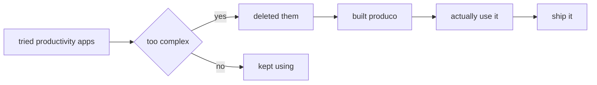

<div align="center">


<a href="https://github.com/yousefturkk/produco">
  
</a>

<br />


</div>

---

<table>
<tr>
<td width="58%" valign="top">

## `// what is produco`

```txt
name        produco
type        productivity tracker
built       with vanilla js, html, css
storage     localStorage (no backend)
philosophy  simple > complex
```

i built this because every productivity app tries to do too much.

```txt
problem:
  most productivity tools are bloated, expensive, or require accounts.

solution:
  a simple tracker that lives in your browser. no signup. no ai. just works.
```

what it actually does:

- track tasks with deadlines
- focus timer for deep work sessions
- stats that show where time goes
- achievements for consistency
- saves everything locally

</td>
<td width="42%" valign="top">

## `// the stack`

```txt
frontend    vanilla js · html · css
storage     localStorage
design      dark theme · responsive
build       no frameworks · no dependencies
```


</td>
</tr>
</table>

---

<div align="center">

## `// features`

</div>

<table>
<tr>
<td width="33%" valign="top">

### `01` task manager

add, complete, delete tasks. set deadlines. see what's due.

```txt
no kanban boards
no complex workflows
just tasks that need doing
```

</td>
<td width="33%" valign="top">

### `02` focus timer

pomodoro-style timer for deep work. track sessions.

```txt
25min work · 5min break
session history
no notifications that annoy
```

</td>
<td width="33%" valign="top">

### `03` stats dashboard

see where your time actually goes. simple charts.

```txt
tasks completed
focus hours logged
streak tracking
no fake productivity metrics
```

</td>
</tr>
</table>

---

## `// how it works`

<details>
<summary><b>open: technical details</b></summary>

<br />

```txt
architecture:
  single page app
  vanilla javascript
  css grid + flexbox
  localStorage for persistence

why vanilla:
  no build step
  instant load
  works everywhere
  easy to modify

data structure:
  tasks: array of objects
  timer sessions: logged with timestamps
  achievements: unlocked based on patterns
```

</details>

<details>
<summary><b>open: design decisions</b></summary>

<br />

```txt
dark mode only:
  easier on eyes
  looks better
  saves battery

no backend:
  privacy first
  works offline
  no account needed
  data stays on your machine

no ai:
  doesn't need it
  faster without it
  more predictable
  actually useful
```

</details>

---

## `// demo`

<details>
<summary><b>see it in action</b></summary>

<br />

```txt
1. open index.html in browser
2. add a task
3. start the timer
4. check your stats
5. that's it. seriously.
```

no demo video. no screenshots. try it yourself or don't.

</details>

---

## `// why i built this`



truth is: most productivity tools are designed to make you feel productive, not actually productive.

this one is different because:

- it does 3 things well instead of 20 things poorly
- it doesn't try to gamify your life
- it doesn't need an account
- it doesn't send your data anywhere
- it's free and open source

---

## `// roadmap`

<details>
<summary><b>what's next</b></summary>

<br />

```txt
maybe:
  - export/import data
  - more themes
  - keyboard shortcuts
  - mobile app version

probably not:
  - ai features
  - team collaboration
  - subscription model
  - complex integrations
```

</details>

---

## `// run it`

```bash
# clone
git clone https://github.com/yousefturkk/produco

# open
open produco/index.html

# done
```

no npm install. no docker. no setup. just open the file.

---

## `// contribute`

if you want to make it better:

```txt
1. fork it
2. make your change
3. test it
4. submit pr
```

rules:

- keep it simple
- no new dependencies
- dark mode only
- useful changes only

---

<div align="center">

## `// connect`

<a href="https://github.com/yousefturkk">
  
</a>
<a href="https://instagram.com/yousefbuilds">
  
</a>

<br /><br />

```txt
if you hate bloated productivity apps and just want something that works:
you'll like produco.
```

</div>


